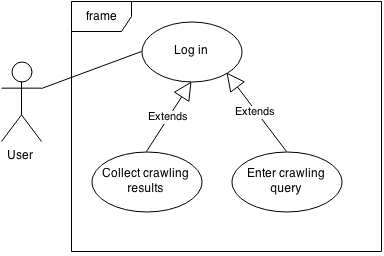
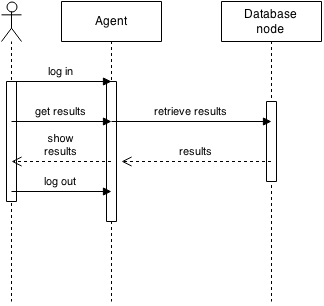

IOSR crawler
============

Semantic web crawler developed during Software Engineering of Distributed
Systems course at AGH university of Science and Technology, Cracow 2015.

Prerequisites
-------------

* python 2.7
* pip
* virtualenv 

Requirements
------------

The list of requirements is presented below. It is an output of `pip freeze`
command run in virtual environment.

* beautifulsoup4==4.3.2
* cffi==0.9.2
* coverage==3.7.1
* cryptography==0.8.2
* cssselect==0.9.1
* Django==1.8
* enum34==1.0.4
* lxml==3.4.4
* mock==1.0.1
* nltk==3.0.2
* oauthlib==0.7.2
* protobuf==2.5.0
* pyasn1==0.1.7
* pycparser==2.10
* PyJWT==1.0.1
* pyOpenSSL==0.15.1
* python-openid==2.2.5
* python-social-auth==0.2.5
* queuelib==1.2.2
* requests==2.6.0
* requests-oauthlib==0.4.2
* riak==2.2.0
* riak-pb==2.0.0.16
* Scrapy==0.24.6
* six==1.9.0
* Twisted==15.1.0
* w3lib==1.11.0
* wheel==0.24.0
* zope.interface==4.1.2

Settings
--------

In order to configure agents provide list of their endpoints in AGENTS_URL
variable located in crawler/settings.py file. It should be reachable for all
agents, so that they can communicate.

It is also possible to adjust crawling accuracy by setting KEYWORDS_THRESHOLD
value. It depicts how many keywords out of all keyword of given query should be
found on the page to connect this page with the query. Value 1 means that all
keywords should be found.

Architecture
------------

System architecture is presented below. It is a peer to peer architecture, where
each agent in independent form each other and is responsible for crawling given
pool of IP addresses or given domain. Result are collected in distributed
database. User can connect to any agent in order to enter crawling query or
collect result of previous crawling queries. Each request concerning new
crawling query is forwarded using HTTP protocol to other agents.

System components and technologies
----------------------------------

We distinguish three main components in our system:

* user interface implemented using `Django` framework
* web crawler build on `Scrapy` library
* natural language processor using `nltk` library enables semantic recognition

User authentication is achieved with OAuth2 standard and third party providers.
In order to store crawling results distributed Raik database is used.
Communication between application and database is base on `Google Protocol Buffers`
messages and `Riak python client` library.

Use cases
---------

Following use cases can be identified:

* As a user I would like to log in the system in order to use crawler.
* As a logged in user I would like to enter new query in order to crawl web pages.
* As a logged in user I would like to collect crawling results from previous queries.

Sequence diagrams
-----------------

The diagrams below presents two main actions that can be executed in the system
by user. Namely:

* enter new crawling query
* collect crawling results

##### New crawling query #####

1. User logs in the system using any agent.
2. User is authenticated using OAuth standard and third party providers
3. User enters crawling query and possibly logs out.
4. User's query is forwarded to other agents.
5. User's query is analysed and keyword are selected.
6. Crawling process in spawned on each agent. Each agent is crawling given pool
of IP addresses or given domain.
7. Crawling result are stored in database.

##### Collect results #####

1. User logs in the system using any agent.
2. User collects crawling results.
3. Crawling results are retrieve from database and presented to the user.
4. User logs out.

##### Coverage report #####

Continuous integration server is available at:
https://travis-ci.org/krzysztof-trzepla/iosr-crawler

<pre><code>
Name                                    Stmts   Miss  Cover
-----------------------------------------------------------
src/__init__                                0      0   100%
src/crawler/__init__                        0      0   100%
src/crawler/config                          4      0   100%
src/crawler/urls                            5      0   100%
src/crawler/wsgi                            4      4     0%
src/engine/CrawlerEngine                   59     24    59%
src/engine/__init__                         0      0   100%
src/engine/db_engine/DbEngine              47      0   100%
src/engine/db_engine/__init__               1      0   100%
src/engine/search_engine/SearchEngine      25      4    84%
src/engine/search_engine/__init__           1      0   100%
src/manage                                  6      0   100%
src/nlp/__init__                            0      0   100%
src/nlp/extractor                          89      1    99%
src/ui/__init__                             0      0   100%
src/ui/admin                                1      0   100%
src/ui/forms                                5      0   100%
src/ui/migrations/__init__                  0      0   100%
src/ui/models                               1      0   100%
src/ui/urls                                 8      0   100%
src/ui/views                               38     13    66%
-----------------------------------------------------------
TOTAL                                     294     46    84%
</code></pre>