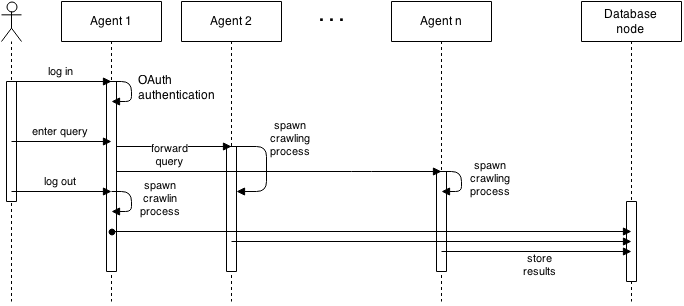

IOSR crawler
============

Semantic web crawler developed during Software Engineering of Distributed Systems course at AGH university of Science 
and Technology, Cracow 2015.

Prerequisites
-------------

* python 2.7
* pip
* virtualenv 

Requirements
------------

The list of requirements is presented below. It is an output of `pip freeze`
command run in virtual environment.

* Django==1.8
* oauthlib==0.7.2
* PyJWT==1.0.1
* python-openid==2.2.5
* python-social-auth==0.2.5
* requests==2.6.0
* requests-oauthlib==0.4.2
* six==1.9.0

Architecture
------------

System architecture is presented below. It is a peer to peer architecture, where
each agent in independent form each other and is responsible for crawling given
pool of IP addresses or given domain. Result are collected in distributed
database. User can connect to any agent in order to enter crawling query or
collect result of previous crawling queries. Each request concerning new
crawling query is forwarded using HTTP protocol to other agents.

System components and technologies
----------------------------------

We distinguish three main components in our system:

* user interface implemented using `Django` framework
* web crawler build on `Scrapy` library
* natural language processor using `nltk` library enables semantic recognition

User authentication is achieved with OAuth2 standard and third party providers.
In order to store crawling results distributed Raik database is used.
Communication between application and database is base on `Google Protocol Buffers`
messages and `Riak python client` library.

Use cases
---------

Following use cases can be identified:

* As a user I would like to log in the system in order to use crawler.
* As a logged in user I would like to enter new query in order to crawl web pages.
* As a logged in user I would like to collect crawling results from previous queries.

Sequence diagrams
-----------------

The diagrams below presents two main actions that can be executed in the system
by user. Namely:

* enter new crawling query
* collect crawling results

##### New crawling query #####

1. User logs in the system using any agent.
2. User is authenticated using OAuth standard and third party providers
3. User enters crawling query and possibly logs out.
4. User's query is forwarded to other agents.
5. User's query is analysed and keyword are selected.
6. Crawling process in spawned on each agent. Each agent is crawling given pool
of IP addresses or given domain.
7. Crawling result are stored in database.

##### Collect results #####

1. User logs in the system using any agent.
2. User collects crawling results.
3. Crawling results are retrieve from database and presented to the user.
4. User logs out.